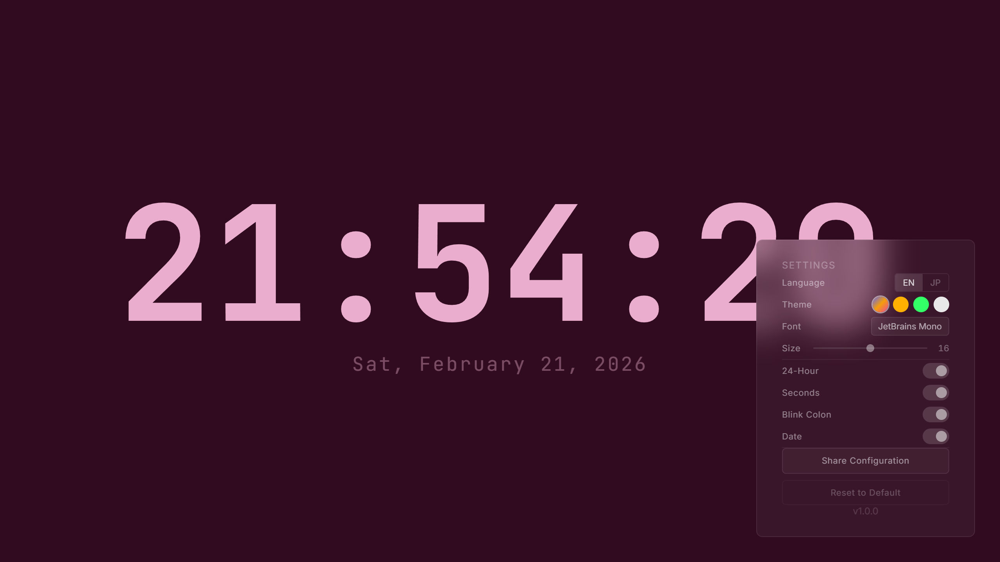

# WALL-CLOCK

**The Digital Gear** — A browser-based wall clock built for display longevity and circadian care.

**[Live Demo](https://tipsytapstudio.github.io/wall-clock/)**



Developed by [Tipsy Tap Studio](https://github.com/TipsyTapStudio).

## Features

### Pixel Shifter 2.0
Automatically shifts the clock display by ±2 pixels every 10 minutes to statistically prevent OLED/LCD burn-in.

### Circadian Eye Care
The **Dynamic** theme maps a full HSL color cycle to the 24-hour day and activates a warm, low-saturation night mode between 22:00 and 06:00.

### Zero-Waste Engine
When seconds display is disabled, the clock updates only once per minute — minimizing CPU/GPU usage for always-on displays.

### Theme Customization
Four built-in themes to match any environment:
- **Dynamic** — HSL gradient that follows the time of day
- **Amber** — Warm retro terminal aesthetic
- **Phosphor** — Classic green CRT look
- **Midnight** — High-contrast monochrome

### Ghost UI
Settings panel stays hidden until you interact. Move the mouse or tap the screen to reveal configuration options, which auto-hide after 3 seconds of inactivity.

### Configuration Sharing
Share your clock setup with anyone via a compact URL. Settings are serialized into short query parameters for easy sharing and bookmarking.

### Internationalization
Full support for English and Japanese, including locale-aware date formatting.

## Getting Started

```bash
# Install dependencies
npm install

# Start development server
npm run dev

# Build for production
npm run build

# Preview production build
npm run preview
```

Open the app in any modern browser and go full-screen for the best experience.

## Settings

| Option       | Description                              |
|--------------|------------------------------------------|
| Language     | English / Japanese                       |
| Theme        | Dynamic, Amber, Phosphor, Midnight       |
| Font         | JetBrains Mono, Geist, Inter, Noto Serif JP |
| Font Size    | Continuously adjustable (4–28 vw)        |
| 24-Hour      | Toggle 24h / 12h format                  |
| Show Seconds | Toggle seconds display                   |
| Blink Colon  | Toggle colon blinking animation          |
| Show Date    | Toggle locale-aware date display         |

## Tech Stack

- **React 19** + **TypeScript**
- **Vite 7** — Fast build tooling
- **Tailwind CSS 4** — Utility-first styling
- **Google Fonts** — JetBrains Mono, Geist, Inter, Noto Serif JP

No external state management libraries — all state is handled with React hooks, LocalStorage, and URL parameters.

## License

[MIT](./LICENSE) — Tipsy Tap Studio
